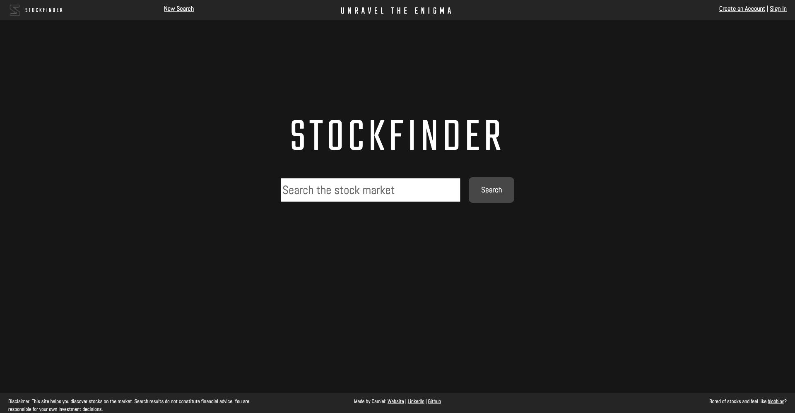
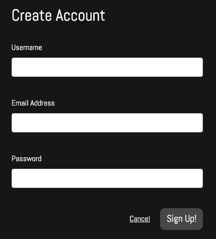
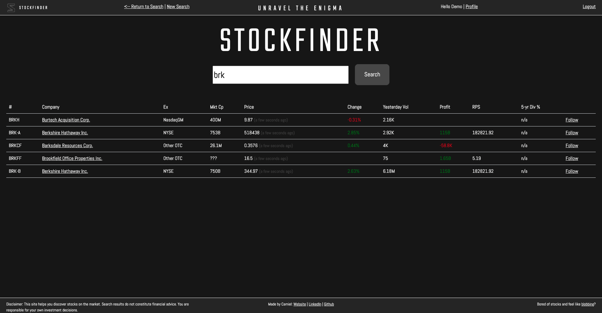
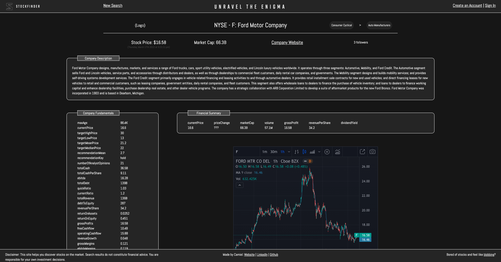
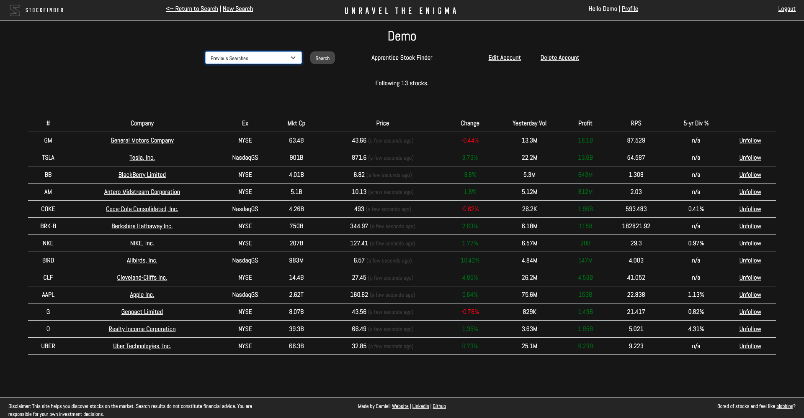

## STOCKFINDER

> Made by Camiel (2022).

# 

## Introduction

**Stockfinder** is a stock market search app that aims to empower you to unravel the engima of the stock market and discover new places where you may not have previously considered going. In the long term it is envisaged that this app will become a platform for which people can connect with stocks that meet their investing criteria and then explore them further.

> **NOTE: THIS IS NOT A STOCK TRADING APP.** There is no intention to allow the buying or selling of equities on this app now or in the future. This app exist purely to allow users to discover lesser-known stocks and new areas of the stock market.

To use the app, please see the Heroku link below.

## Features
**Stockfinder** contains a variety of features to assist you in your journey through the stock market. To access all features and get the best searching experience, consider creating a Stockfinder account.

### Search
The central part of the app is the search feature. At anytime you can type into the search box and Stockfinder will hunt through the stock market to find relevant results. Currently, search queries are limited to equities listed on US-based exchanges.

### Details
Upon a successful search the user will be presented with a list of results for various equities. A couple of key metrics will be displayed alongside this list. The user can then click ont he company names to view a detailed page with a full description of the company, a link to its website, various financials metrics and a chart of stock price.

### User Accounts
Upon creating a Stockfinder account the user has access to a couple of additional features which can be explored on the user's profile page.
- "Return to Search" button and a log of the user's previous searches, allowing the user to return to previous searches in case they want to pick up something they may have missed.
- "Follow/Unfollow" stocks, which saves a stock to the user's profile, allowing them quick access to stocks of interest in future without having to remember or search for them again.
- Basic account management including the ability for a user to edit or delete their account.

## TECHNICAL DETAILS
> This app was built as part of General Assembly's Software Development Bootcamp.

This app was built using **HTML**, **CSS**, **JavaScript**, **Node.js**, **Express**, **Bootstrap** and **MongoDB**. Additionally, **various third-party API's** contributed to the functioning of this app, including: Alpha Vantage, Finnhub and Yahoo Finance.

Warning: due to time constraints there are some critical issues and missing features (for example, the search functionality is extremely grumpy). These will be fixed over time, so please do check back later if need be.

> **Heroku:** tba

> **Git Repo:** https://github.com/Runite-Drill/Stockfinder.git

> **Trello Board:** https://trello.com/b/6LnkteNK/sei-48-project-2-stockfinder

> **Figma Wireframe:** https://www.figma.com/file/62SMy7wk0IsCSureWu78ER/STOCKFINDER?node-id=0%3A1

> **Entity Relationship Diagram:** https://lucid.app/lucidchart/5359c9a4-245e-4fcb-abdc-00b5859cfbac/edit?invitationId=inv_91d3608b-fd8d-424b-b36e-00060f4b8adc

## NEXT STEPS
There are a large number of possibilities to further the development of this app. Many ideas are listed in Trello, but some key proposed features and fixes are below:
- General fixes, optimisations and improvements to the search function including stability fixes and the ability to search by tags or keywords.
- Filtering and sorting to search results, plus smart/pivot tables.
- Look up other user profiles and further customisation of profiles.
- Leave private user notes on stocks of interest so users can remember their thoughts later.
- Set notifications and alerts so you never miss an opportunity.
- Provide links to relevant news sources and trading platforms.
- Google/Facebook/social single sign-on.
